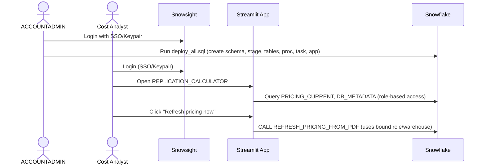

# Auth Flow - Streamlit DR Replication Cost Calculator
Author: SE Community
Last Updated: 2025-12-08
Expires: 2026-01-07
Status: Reference Implementation

Reference Implementation: This code demonstrates production-grade architectural patterns and best practices. Review and customize security, networking, and logic for your organization's specific requirements before deployment.

## Overview
Authentication and authorization for deployment and use of the replication/DR cost calculator in Snowflake (Business Critical).

## Component Descriptions
- Identity: SSO/Keypair via Snowsight; roles managed in Snowflake.
- Roles: `ACCOUNTADMIN` for deploy; app runs with assigned app role to read pricing/metadata and call proc.
- Session: Snowsight-provided session passed to Streamlit app.
- Authorization: SQL grants to schema/tables/procedure; task runs with owner’s rights.
- Warehouse: `SFE_REPLICATION_CALC_WH` for pricing refresh/task and metadata queries.

## Change History
See `.cursor/DIAGRAM_CHANGELOG.md` for vhistory.
