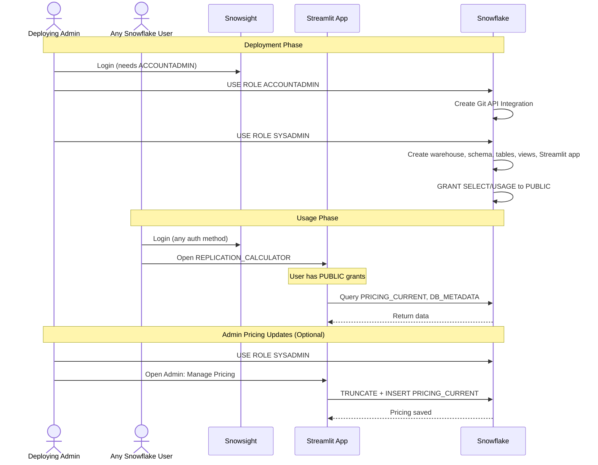

# Auth Flow - Streamlit DR Replication Cost Calculator
Author: SE Community
Last Updated: 2025-12-08
Expires: 2026-04-10
Status: Reference Implementation

Reference Implementation: This code demonstrates production-grade architectural patterns and best practices. Review and customize security, networking, and logic for your organization's specific requirements before deployment.

## Overview
Authentication and authorization for deployment and use of the replication/DR cost calculator in Snowflake (Business Critical).

## Component Descriptions

### Authentication
- **Identity**: SSO, Key Pair, or username/password via Snowsight
- **Session**: Snowsight-provided session passed to Streamlit app
- **No custom authentication**: Uses standard Snowflake auth mechanisms

### Authorization (Role-Based Security)

#### Deployment Roles
- **ACCOUNTADMIN**: Creates Git API integration only (lines 31-68 in deploy_all.sql)
- **SYSADMIN**: Creates all database objects - owns them (lines 73+ in deploy_all.sql)
  - Warehouse, schema, tables, views, Streamlit app

#### Usage Roles
- **PUBLIC**: Granted SELECT and USAGE permissions (lines 208-216 in deploy_all.sql)
  - Any Snowflake user can run the demo
  - Read-only access to pricing tables/views
  - USAGE on warehouse for queries
  - USAGE on Streamlit app
  - Cannot modify pricing data

### Warehouse
- **SFE_REPLICATION_CALC_WH**: Used by Streamlit app queries
  - Auto-suspend after 60 seconds
  - Auto-resume on query
  - XSmall size for demo workloads

## Change History
See `.cursor/DIAGRAM_CHANGELOG.md` for vhistory.
