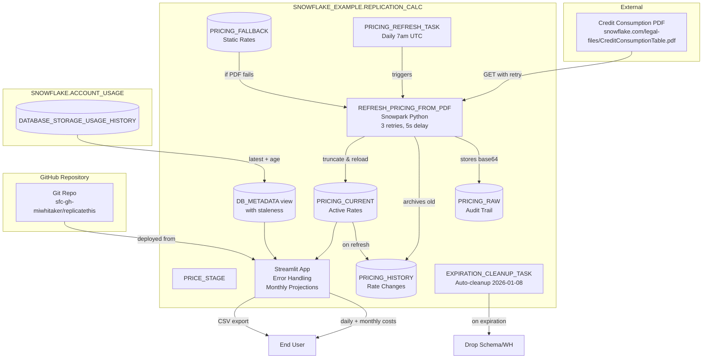

# Data Flow - Streamlit DR Replication Cost Calculator
Author: SE Community
Last Updated: 2025-12-08
Expires: 2026-01-07
Status: Reference Implementation

Reference Implementation: This code demonstrates production-grade architectural patterns and best practices. Review and customize security, networking, and logic for your organization's specific requirements before deployment.

## Overview
Data ingestion and transformation flow for replication/DR cost estimation using Business Critical pricing.

## Component Descriptions

### Data Storage
- **PRICE_STAGE**: Internal stage for staging assets if needed
- **PRICING_RAW**: Audit trail with base64-encoded PDF content and fetch timestamps
- **PRICING_FALLBACK**: Static fallback rates (12 rows) for AWS/Azure/GCP regions when PDF unavailable
- **PRICING_HISTORY**: Historical rate tracking - archives old rates on each refresh for trend analysis
- **PRICING_CURRENT**: Active normalized rates per cloud/region/service with estimate flags
- **DB_METADATA**: Database sizes from ACCOUNT_USAGE with `DATA_AGE_DAYS` staleness indicator

### Processing
- **REFRESH_PRICING_FROM_PDF**: Snowpark Python procedure with retry logic (3 attempts, 5s delay)
  - Fetches PDF from Snowflake public URL
  - Archives current pricing to history table
  - Reloads current pricing from fallback rates
  - Handles network errors gracefully
- **PRICING_REFRESH_TASK**: Scheduled task running daily at 7am UTC
- **EXPIRATION_CLEANUP_TASK**: Automated cleanup task (drops schema/warehouse/role on 2026-01-08)

### User Interface
- **Streamlit App**: Auto-deployed from Git repository (lines 91-96 in deploy_all.sql)
  - Loads directly from `@SNOWFLAKE_EXAMPLE.TOOLS.REPLICATE_THIS_REPO/branches/main/streamlit`
  - No manual file uploads required
  - Interactive cost calculator with:
    - Error handling for all database calls
    - Cloud/region detection via SYSTEM$ functions
    - Monthly and annual cost projections
    - Lowest-cost region recommendations
    - Enhanced CSV export with full assumptions
    - Input validation and helpful error messages

## Key Features

### Reliability
- Retry logic for PDF fetches
- Fallback rates ensure app always functional
- Comprehensive error handling in Streamlit
- Historical rate tracking for auditing

### Usability
- Cost disclaimer prominently displayed
- Database selection validation
- Data staleness indicators
- Monthly/annual projections (not just daily)
- Region cost comparison feature

### Security & Governance
- Role-based security: ACCOUNTADMIN → SYSADMIN (owns objects) → PUBLIC (grants)
- Objects owned by SYSADMIN (best practice)
- PUBLIC granted read-only access (SELECT, USAGE)
- Automated cleanup on expiration
- Audit trail in PRICING_RAW table
- Minimal privilege grants (no ACCOUNTADMIN dependencies for users)

### Maintainability
- Fallback rates in table (not hardcoded)
- Rate history for troubleshooting
- CI/CD validation for SQL
- Pre-commit hooks for code quality

## Change History
See `.cursor/DIAGRAM_CHANGELOG.md` for vhistory.
