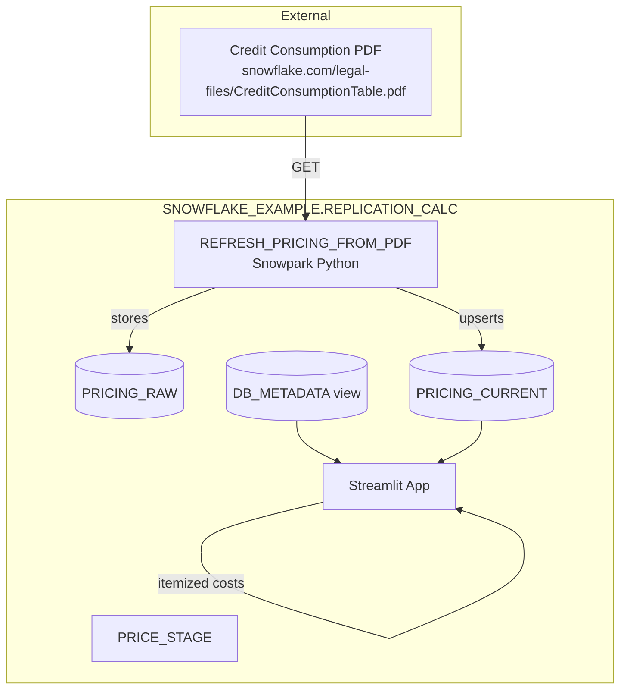

# Data Flow - Streamlit DR Replication Cost Calculator
Author: SE Community
Last Updated: 2025-12-08
Expires: 2026-01-07
Status: Reference Implementation

Reference Implementation: This code demonstrates production-grade architectural patterns and best practices. Review and customize security, networking, and logic for your organization's specific requirements before deployment.

## Overview
Data ingestion and transformation flow for replication/DR cost estimation using Business Critical pricing.

## Component Descriptions
- PRICE_STAGE: Internal stage used to hold fetched assets if needed.
- PRICING_RAW: Base64 copy of the PDF for traceability.
- REFRESH_PRICING_FROM_PDF: Snowpark Python proc to fetch PDF, parse/estimate, and populate `PRICING_CURRENT`.
- PRICING_CURRENT: Normalized rates per cloud/region/service with estimate flags.
- DB_METADATA: Database sizes from ACCOUNT_USAGE for sizing transfer/storage.
- Streamlit App: Uses pricing + metadata to compute replication/DR costs.

## Change History
See `.cursor/DIAGRAM_CHANGELOG.md` for vhistory.
