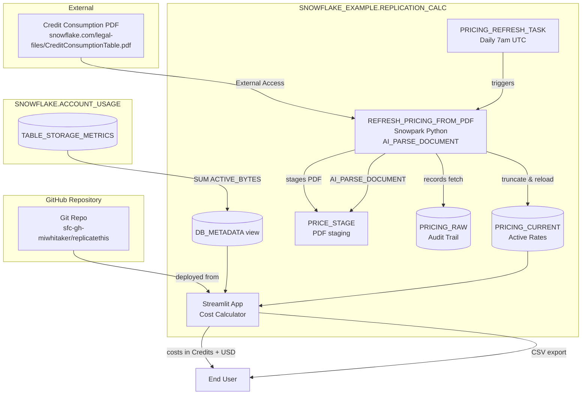

# Data Flow - Streamlit DR Replication Cost Calculator
Author: SE Community
Last Updated: 2025-12-10
Expires: 2026-01-07
Status: Reference Implementation

Reference Implementation: This code demonstrates production-grade architectural patterns and best practices. Review and customize security, networking, and logic for your organization's specific requirements before deployment.

## Overview
Data ingestion and transformation flow for replication/DR cost estimation using Business Critical pricing.

## Component Descriptions

### Data Storage
- **PRICE_STAGE**: Internal stage for staging the Credit Consumption PDF for AI parsing
- **PRICING_RAW**: Audit trail recording PDF fetch status and timestamps
- **PRICING_CURRENT**: Active normalized rates per cloud/region/service with IS_ESTIMATE flag
- **DB_METADATA**: View joining INFORMATION_SCHEMA.DATABASES with TABLE_STORAGE_METRICS for sizes

### Processing
- **REFRESH_PRICING_FROM_PDF**: Snowpark Python procedure with AI parsing
  - Downloads PDF via External Access Integration
  - Stages PDF to PRICE_STAGE
  - Calls SNOWFLAKE.CORTEX.PARSE_DOCUMENT for text extraction
  - Attempts to parse pricing tables from extracted content
  - Falls back to hardcoded rates if parsing fails (IS_ESTIMATE = TRUE)
- **PRICING_REFRESH_TASK**: Scheduled task running daily at 7am UTC

### User Interface
- **Streamlit App**: Auto-deployed from Git repository
  - Loads directly from `@SNOWFLAKE_EXAMPLE.TOOLS.REPLICATE_THIS_REPO/branches/main/streamlit`
  - No manual file uploads required
  - Interactive cost calculator with:
    - Price per credit input for contract/discount pricing
    - Dual display: Credits AND USD costs
    - Cloud/region selection (source auto-detected, destination selectable)
    - Daily, monthly, and annual cost projections
    - Lowest-cost region recommendations
    - CSV export with full assumptions and USD values

## Key Features

### Native Snowflake Architecture
- External Access Integration for PDF download (no external orchestration)
- AI_PARSE_DOCUMENT for native PDF text extraction
- Streamlit in Snowflake for UI (no external hosting)
- Git repository integration (auto-deploy from GitHub)

### Reliability
- Fallback rates ensure app always functional
- Graceful error handling throughout
- IS_ESTIMATE flag indicates data source (parsed vs fallback)

### Usability
- Price per credit slider for discount calculations
- Costs shown in both Credits and USD
- Database selection with size display
- Data freshness indicator (AS_OF timestamp)
- CSV export with all assumptions documented

### Security & Governance
- Role-based security: ACCOUNTADMIN → SYSADMIN → PUBLIC
- Minimal privilege: ACCOUNTADMIN only for account-level objects
- Objects owned by SYSADMIN (best practice)
- PUBLIC granted read-only access (SELECT, USAGE)
- Audit trail in PRICING_RAW table

## Change History
See `.cursor/DIAGRAM_CHANGELOG.md` for vhistory.
