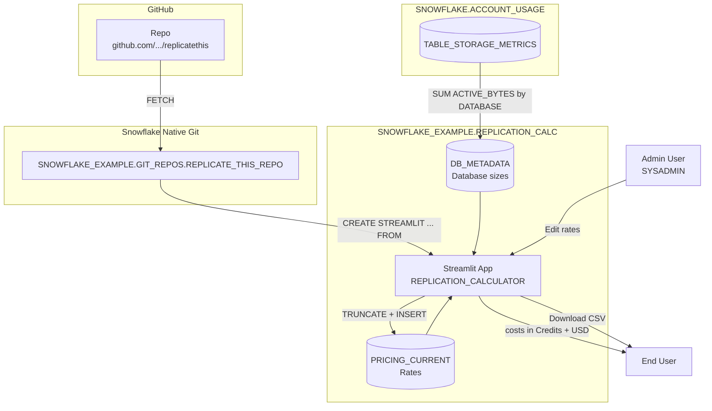

# Data Flow - Streamlit DR Replication Cost Calculator
Author: SE Community
Last Updated: 2025-12-10
Expires: 2026-04-10
Status: Reference Implementation

Reference Implementation: This code demonstrates production-grade architectural patterns and best practices. Review and customize security, networking, and logic for your organization's specific requirements before deployment.

## Overview
Data ingestion and transformation flow for replication/DR cost estimation using Business Critical pricing.

## Component Descriptions

### Data Storage
- **PRICING_CURRENT**: Active normalized rates per cloud/region/service (seeded by `deploy_all.sql`, editable by admins)
- **DB_METADATA**: View joining INFORMATION_SCHEMA.DATABASES with TABLE_STORAGE_METRICS for sizes

### Processing
- **DB_METADATA**: Aggregates ACTIVE_BYTES to per-database sizes for UI selection and sizing

### User Interface
- **Streamlit App**: Created from Git repository clone
  - Source: `SNOWFLAKE_EXAMPLE.GIT_REPOS.REPLICATE_THIS_REPO`
  - No manual file uploads required
  - Interactive cost calculator with:
    - Price per credit input for contract/discount pricing
    - Dual display: Credits and USD costs
    - Cloud/region selection (source auto-detected, destination selectable)
    - Daily, monthly, and annual cost projections
    - Lowest-cost region recommendations
    - CSV export with full assumptions and USD values

## Key Features

### Native Snowflake Architecture
- Streamlit in Snowflake for UI (no external hosting)
- Git repository integration (auto-deploy from GitHub)

### Reliability
- Graceful error handling throughout
 - Seeded default rates ensure the app is usable immediately after deployment

### Usability
- Price per credit slider for discount calculations
- Costs shown in both Credits and USD
- Database selection with size display
- Data freshness indicator (AS_OF timestamp)
- CSV export with all assumptions documented

### Security & Governance
- Role-based security: ACCOUNTADMIN → SYSADMIN → PUBLIC
- Minimal privilege: ACCOUNTADMIN only for account-level objects
- Objects owned by SYSADMIN (best practice)
- PUBLIC granted read-only access (SELECT, USAGE)
 - Pricing edits require SYSADMIN/ACCOUNTADMIN (enforced by app and table privileges)

## Change History
See `.cursor/DIAGRAM_CHANGELOG.md` for vhistory.
