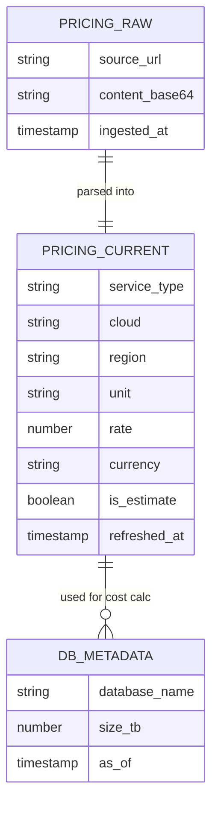

# Data Model - Streamlit DR Replication Cost Calculator
Author: SE Community
Last Updated: 2025-12-08
Expires: 2026-01-07
Status: Reference Implementation

Reference Implementation: This code demonstrates production-grade architectural patterns and best practices. Review and customize security, networking, and logic for your organization's specific requirements before deployment.

## Overview
Data model for pricing ingestion, normalized rates, and database metadata used by the Streamlit replication/DR cost calculator (Business Critical).

## Component Descriptions
- PRICING_RAW: Stores fetched Credit Consumption PDF content (base64) and source URL.
- PRICING_CURRENT: Normalized pricing rows (BC rates) per service/cloud/region with estimate flag and refreshed_at.
- DB_METADATA: Latest database sizes from ACCOUNT_USAGE for sizing transfer/storage.

## Change History
See `.cursor/DIAGRAM_CHANGELOG.md` for vhistory.
