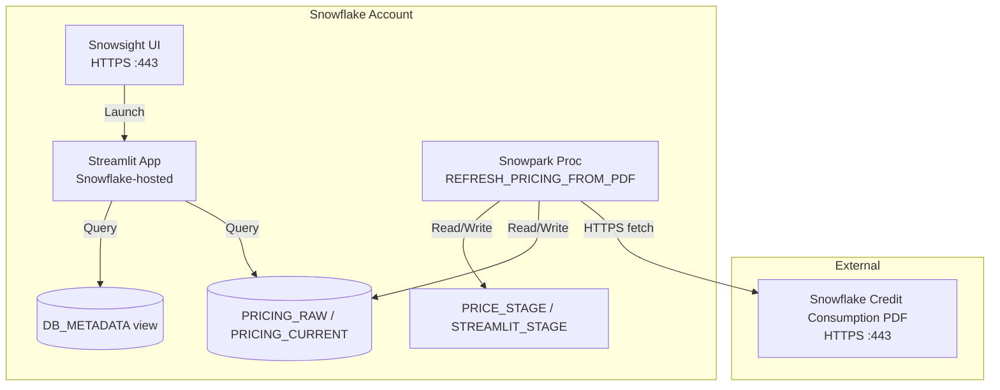

# Network Flow - Streamlit DR Replication Cost Calculator
Author: SE Community
Last Updated: 2025-12-08
Expires: 2026-01-07
Status: Reference Implementation

Reference Implementation: This code demonstrates production-grade architectural patterns and best practices. Review and customize security, networking, and logic for your organization's specific requirements before deployment.

## Overview
Network interactions for the replication/DR cost calculator using Business Critical features.

## Component Descriptions
- PDF: Public HTTPS endpoint for Snowflake Credit Consumption table.
- Snowsight: Entry point for deploy and app usage.
- Streamlit App: Runs inside Snowflake; connects to pricing tables/views.
- PRICE_STAGE / STREAMLIT_STAGE: Internal stages for fetched assets and app code.
- Snowpark Proc: Fetches PDF, writes PRICING_RAW/PRICING_CURRENT.
- Tables/Views: Pricing and metadata storage powering the UI.

## Change History
See `.cursor/DIAGRAM_CHANGELOG.md` for vhistory.
